# Despliegue de Kubernetes con kubeadm en Rocky Linux

**Universidad ICESI · Ingeniería de Telemática y Sistemas**

**Curso:** Infraestructura de Redes y Sistemas / Cloud & DevOps

**Estudiante:** Diego Polanco Lozano

**Fecha de validación:** 25 de septiembre de 2026

## Resultado

Se desplegó un clúster de Kubernetes con un control plane y un worker. El Bastión ofrece DHCP y DNS y aloja el `kubeconfig` para administrar el clúster. La validación en vivo confirmó los dos nodos `Ready`, los pods de sistema `Running`, resolución DNS desde un pod del Worker y una respuesta HTTP 200 de Nginx por NodePort.

La actividad solicita Rocky Linux 9.7 y varias interfaces, incluida Bridge. Las VMs del laboratorio ejecutan Rocky Linux 9.8 y, en la configuración comprobada, usan NAT, Host-Only y red interna; no tienen adaptador Bridge. Estos dos puntos quedan como diferencias frente al enunciado.

## Arquitectura y direccionamiento

| VM | Red / interfaz | Dirección | Función |
|---|---|---:|---|
| Bastión | NAT (`enp0s3`) | `10.0.2.15/24` | Salida a Internet |
| Bastión | Host-Only (`enp0s8`) | `192.168.56.10/24` | Administración desde el host |
| Bastión | Interna (`enp0s9`) | `172.20.0.10/24` | DHCP, BIND y comunicación del laboratorio |
| Master | Host-Only (`enp0s8`) | `192.168.56.11/24` | Acceso administrativo |
| Master | Interna (`enp0s9`) | `172.20.0.21/24` | Control plane |
| Worker | Host-Only (`enp0s8`) | `192.168.56.12/24` | Acceso administrativo |
| Worker | Interna (`enp0s9`) | `172.20.0.22/24` | Cargas de trabajo |

Las IP internas de Master y Worker se reservan por MAC desde DHCP. DHCP escucha en `enp0s9`, sirve `172.20.0.0/24`, entrega direcciones dinámicas entre `.100` y `.200` y anuncia DNS `172.20.0.10` con dominio de búsqueda `polanco.lab`. BIND publica los nombres directos e inversos de los equipos.

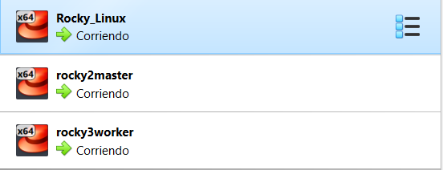

*Figura 1. Las tres máquinas virtuales del laboratorio están encendidas en VirtualBox.*

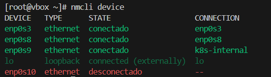

*Figura 2. El Bastión muestra conectadas las interfaces NAT, Host-Only y la interfaz interna `enp0s9`.*

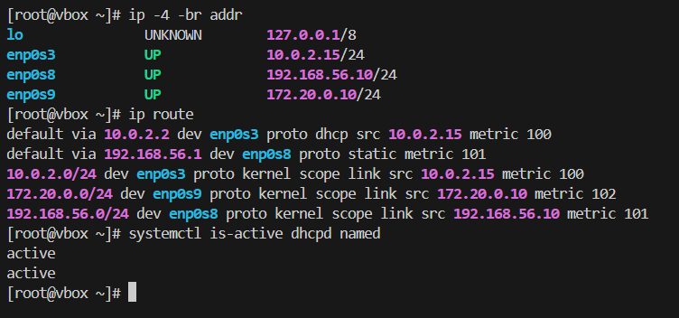

*Figura 3. El Bastión tiene `172.20.0.10/24` en la red interna y muestra `dhcpd` y `named` activos.*

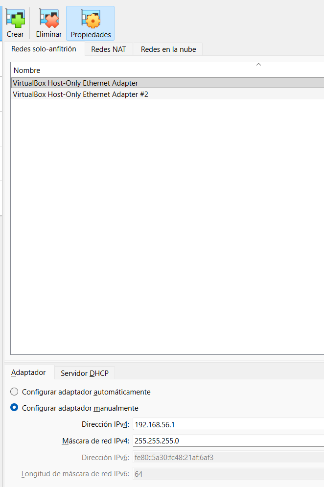

*Figura 4. Red Host-Only configurada en VirtualBox para el acceso administrativo desde el host.*

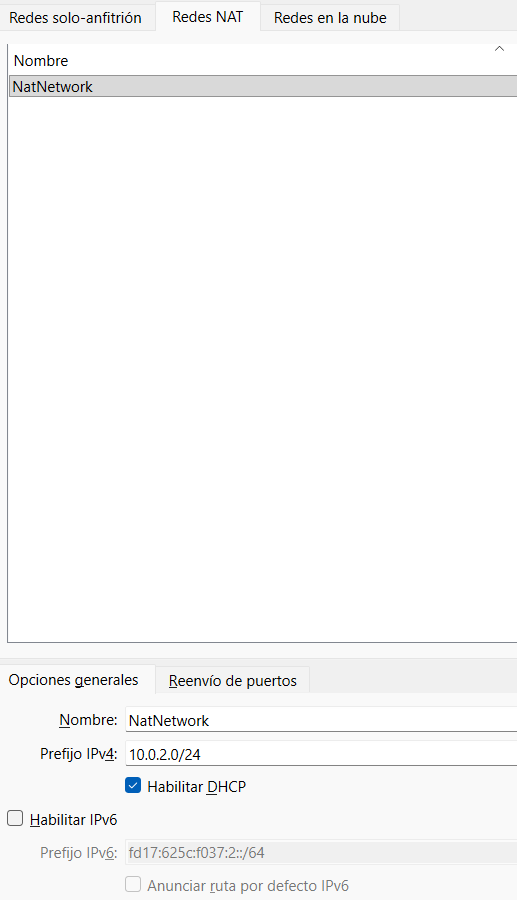

*Figura 5. Red NAT configurada para proporcionar salida a Internet a las máquinas virtuales.*

## Automatización con Ansible

El playbook principal es `site.yml`; `inventory/hosts.ini` separa Bastión, control plane y worker, y `group_vars/all.yml` centraliza dominio, direccionamiento y reservas. Los roles configuran la red y DNS/DHCP del Bastión, preparan los nodos, inicializan Kubernetes, unen el Worker y despliegan las pruebas.

| Rol | Responsabilidad |
|---|---|
| `network` | Configura la interfaz interna y el resolvedor del Bastión. |
| `dns_bind` / `dhcpd` | Instala, configura y valida BIND y DHCP. |
| `k8s_node_network` | Configura hostname, redes y DNS en Master y Worker. |
| `k8s_prerequisites` | Desactiva swap, configura SELinux, kernel, sysctl, containerd, Kubernetes y firewalld. |
| `kubeadm_control_plane` | Inicializa kubeadm y aplica Flannel usando `enp0s9`. |
| `k8s_join_worker` | Une el Worker al clúster. |
| `kubectl_client` | Prepara kubectl y el acceso administrativo desde el Bastión. |
| `k8s_validation` | Despliega Nginx y comprueba NodePort y CoreDNS. |

Desde WSL, en la raíz del repositorio:

```bash
export ANSIBLE_CONFIG=./ansible.cfg
ansible-playbook -i inventory/hosts.ini site.yml --syntax-check
ansible-playbook -i inventory/hosts.ini site.yml --ask-pass --ask-become-pass
```

La corrección de reenvío CNI se puede aplicar de forma aislada:

```bash
ansible-playbook -i inventory/hosts.ini site.yml \
  --limit k8s_nodes --tags pod_network_firewall \
  --ask-pass --ask-become-pass
```

## Fase 1: Bastión, DHCP y DNS

El servicio DHCP valida su archivo de configuración y mantiene reservas por MAC para Master (`172.20.0.21`) y Worker (`172.20.0.22`). BIND responde por `polanco.lab` y sus zonas inversas.

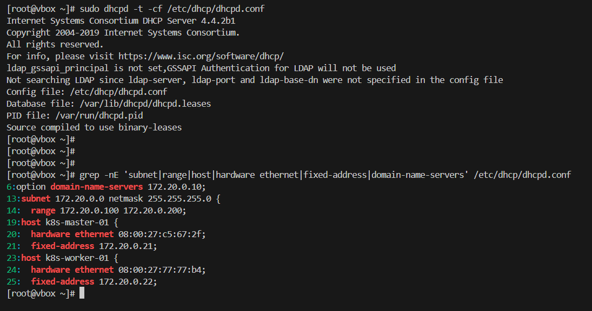

*Figura 6. `dhcpd -t` valida la configuración y se observan el rango dinámico y las dos reservas MAC/IP.*


*Figura 7. Nmap recibe una oferta DHCP desde `172.20.0.10` con DNS `172.20.0.10` y dominio `polanco.lab`.*

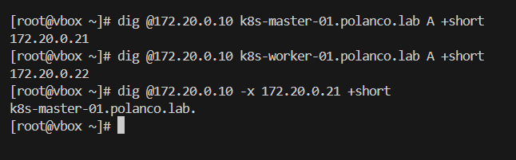

*Figura 8. Las consultas DNS resuelven Master, Worker y la dirección inversa del Master.*

Comandos para repetir la validación desde una máquina con acceso al Bastión:

```bash
sudo systemctl is-active dhcpd named
sudo dhcpd -t
sudo named-checkconf
dig @172.20.0.10 k8s-master-01.polanco.lab A +short
dig @172.20.0.10 k8s-worker-01.polanco.lab A +short
dig @172.20.0.10 -x 172.20.0.21 +short
```

## Fase 2: preparación de los nodos

Ansible configura nombres únicos, desactiva swap de forma persistente, deja SELinux en modo permisivo, carga `overlay` y `br_netfilter`, habilita el reenvío IPv4 y el paso de paquetes por bridges, instala containerd y las herramientas de Kubernetes y abre los puertos requeridos.

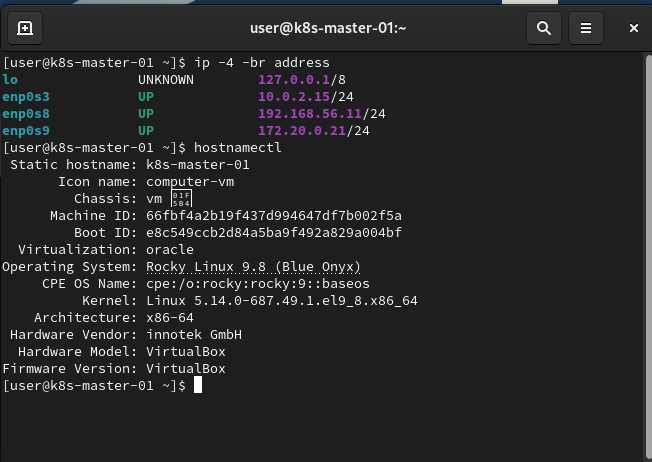

*Figura 9. El Master usa `172.20.0.21` en la red interna; la evidencia identifica Rocky Linux 9.8.*

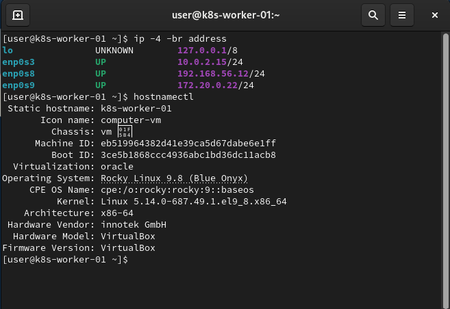

*Figura 10. El Worker usa `172.20.0.22` en la red interna; la evidencia identifica Rocky Linux 9.8.*

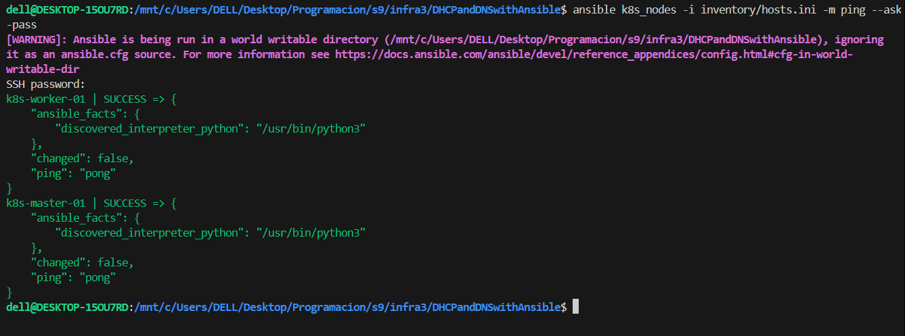

*Figura 11. Ansible alcanza Master y Worker y ambos responden `pong`.*

## Fase 3: control plane, Worker y red de pods

`kubeadm` inicializa el control plane en `172.20.0.21`, con endpoint `k8s-master-01.polanco.lab:6443` y red de pods `10.244.0.0/16`. El Worker se une con la IP `172.20.0.22`. Flannel conecta las redes de pods entre nodos y queda fijado a `enp0s9`, evitando anunciar la IP NAT compartida de VirtualBox.

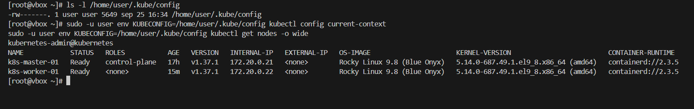

*Figura 12. `kubectl get nodes -o wide` muestra Master y Worker en estado `Ready` y sus IP internas.*


*Figura 13. La salida de `kubectl get pods -A -o wide` muestra CoreDNS, Flannel, kube-proxy, el control plane y Nginx en estado `Running`.*

Comprobaciones desde el Bastión:

```bash
export KUBECONFIG=/home/user/.kube/config
kubectl get nodes -o wide
kubectl get pods -A -o wide
```

## Fase 4: aplicación y DNS de Kubernetes

Un Deployment mantiene una réplica de Nginx programada en el Worker. El Service `taller-nginx` es de tipo NodePort y expone HTTP en `30080`.

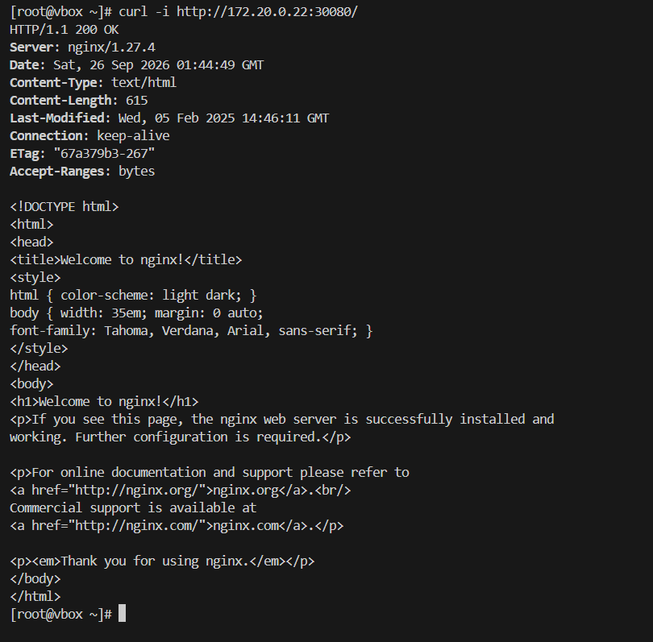

*Figura 14. Una consulta desde el Bastión a `172.20.0.22:30080` recibe HTTP 200 y la página de bienvenida de Nginx.*

CoreDNS se comprobó desde un pod temporal del Worker: `kubernetes.default.svc.cluster.local` resolvió a `10.96.0.1` y `taller-nginx.default.svc.cluster.local` a `10.100.149.204`. La política de firewalld permite el reenvío entre interfaces CNI/VXLAN únicamente para el CIDR de pods `10.244.0.0/16`.

```bash
export KUBECONFIG=/home/user/.kube/config
curl -i http://172.20.0.22:30080/
kubectl run dns-test --image=busybox:1.36.1 --restart=Never \
  --command -- sh -c 'nslookup kubernetes.default.svc.cluster.local && nslookup taller-nginx.default.svc.cluster.local'
kubectl wait --for=jsonpath='{.status.phase}'=Succeeded pod/dns-test --timeout=60s
kubectl logs dns-test
kubectl delete pod dns-test --wait=false
```

## Resultado frente a la rúbrica

| Criterio | Evidencia / resultado |
|---|---|
| Bastión con DHCP y DNS | Servicios activos; configuración DHCP válida; consultas directas e inversas correctas. |
| Reservas para Master y Worker | Reservas por MAC y concesiones `.21` y `.22`. |
| Prerrequisitos de Kubernetes | Configurados mediante Ansible: swap, SELinux, módulos, sysctl, containerd y firewalld. |
| Control plane y Worker | Master y Worker `Ready`, Kubernetes `v1.37.1`, containerd `2.3.5`. |
| CNI y DNS de pods | Flannel en la red interna; consultas CoreDNS comprobadas desde el Worker. |
| Aplicación de prueba | Nginx `Running` en el Worker; NodePort `30080` responde HTTP 200. |
| Rocky Linux solicitado | Parcial: el enunciado indica 9.7; las VMs muestran 9.8. |
| Interfaces de red solicitadas | Parcial: se observan NAT, Host-Only e interna; falta Bridge. |

La prueba no consiste solamente en que los pods estén encendidos: también se confirmó la resolución de servicios desde un pod del Worker y el acceso HTTP al NodePort desde el Bastión. La evidencia fotográfica disponible incluye cada figura con su descripción; la prueba CoreDNS se conserva como resultado de validación en vivo.
